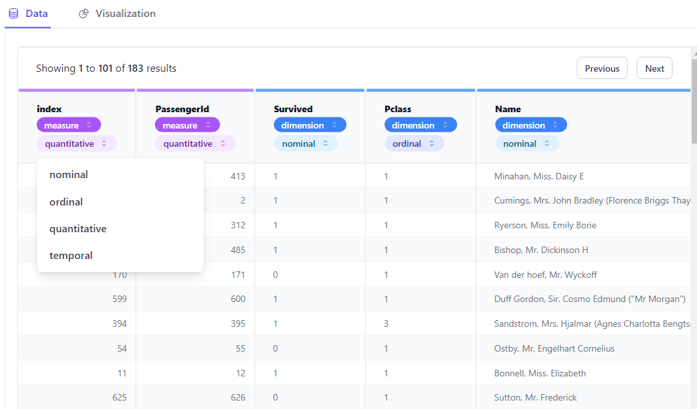
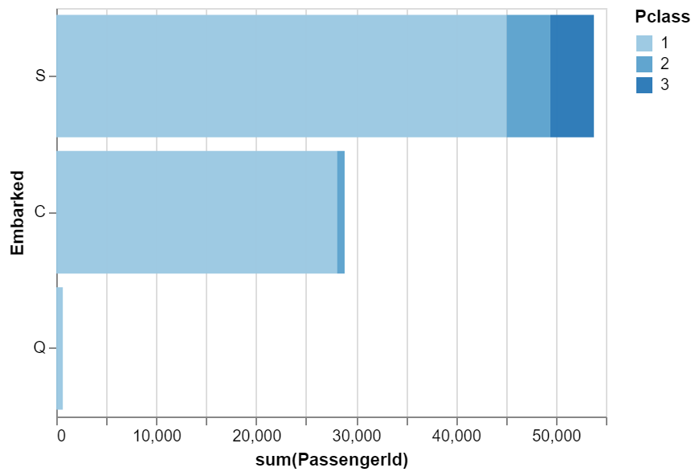
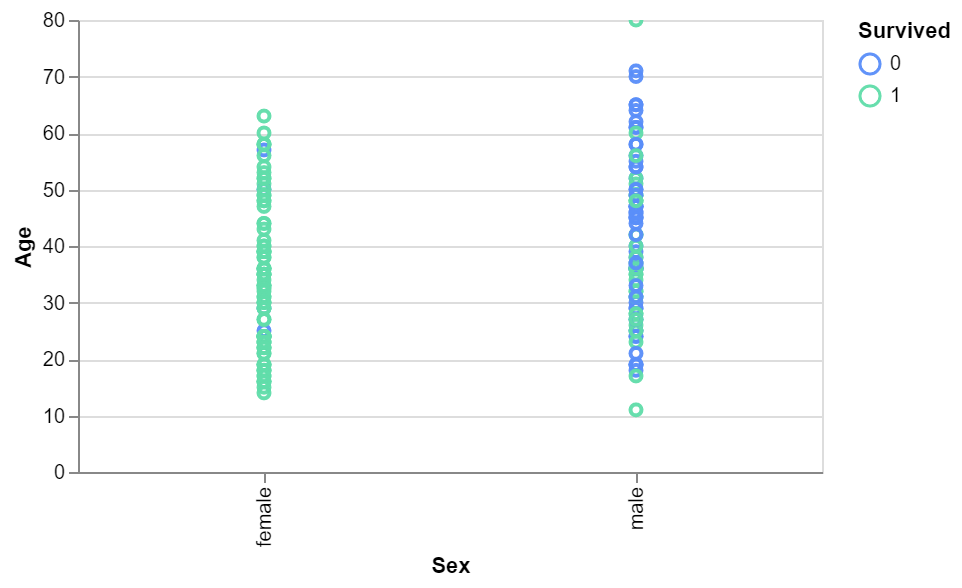
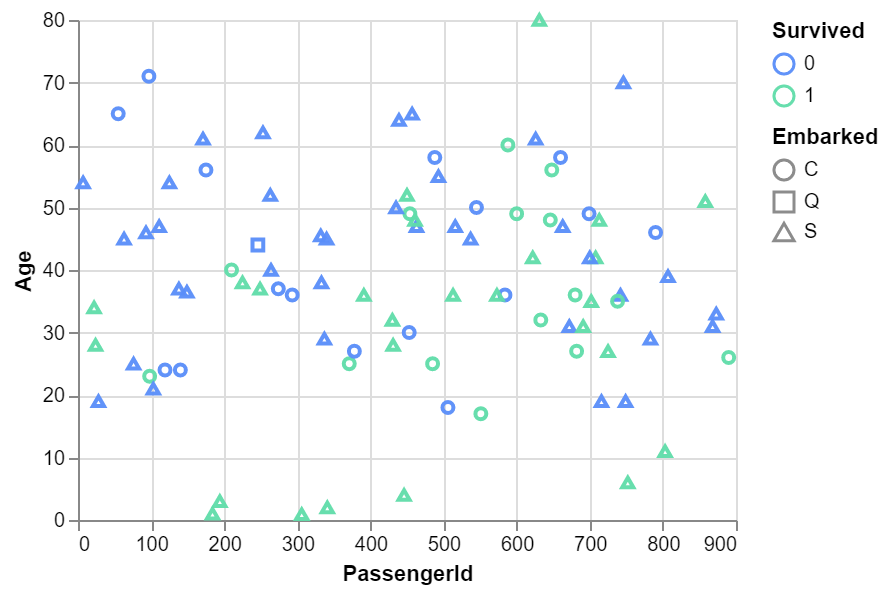
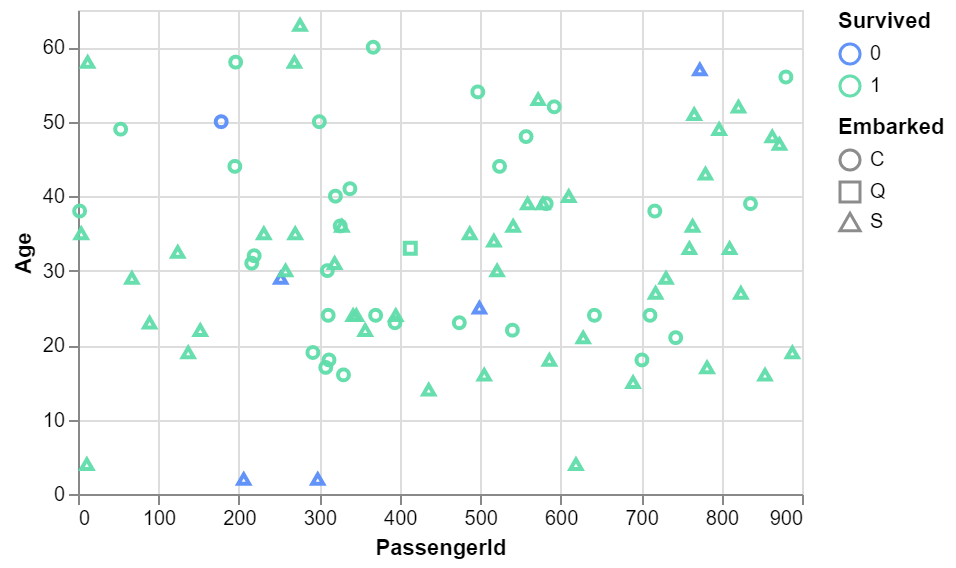

# Data Exploratory using pygwalker
Explore alternative way to Exploratory Data Analysis using pygwalker in jupyter notebook.

## Table of Contents
- [What is PyGWalker?](#pygwalker)
- [Dataset](#dataset)
- [Analysis](#analysis)
- [Reference](#references)

# PyGWalker
PyGWalker (Python binding of Graphic Walker) is a python library that can help speed up the data analysis and visualisation workflow directly within a Jupyter notebook.
The visualizatoin in PyGWalker is interestingly interactive and similar to popular business intelligence tools named Tableau.

You can install pygwalker by command:
```
pip install pygwalker
```
if using pip, or
```
conda install pygwalker
```
if using anaconda.

# Dataset
Dataset using a popular open dataset: [Titanic Dataset](https://www.kaggle.com/competitions/titanic/data).

The description each column as following:
- survived: 0 = No, 1 = Yes
- pclass: Ticket Class (1=1st, 2=2nd, 3=3rd). Can be interpreted as the socio-economic status (SES).
- sex: Male or Female
- age: age in years
- sibsp: number of siblings/ spouses aboard the Titanic
- parch: number of parents/ children aboard the Titanic
- ticket: Ticket number
- fare: Passenger fare
- cabin: Cabin Number
- embarked: Port of Embarkation (C=Cherbourg, Q=Queenstown, S=Southampton)

# Analysis
## UI in PyGWalker


It has two main feature tab: data and visualization.

In data we can check and set the data type of each field. 

The data type either measure or dimension.

The more specific data sub-type options as below:
- nominal
- ordinal
- quantitative
- temporal

While the visualization tab is the playground to create some chart.

### Number of Passenger by Embarked


Most of the passengers aboard from Southamption. Then the second largest group from Cherbourg, while Passenger from Queenstown is the least group.

Breakdown by the pclass (SES class) all embarkment location mostly dominated by 1st class passenger. Meanwhile small portion of each embarkment come from 2nd class. Last but least, all the 3rd class embarked from Southampton.

## Surviived vs Gender




We can tell that most survived is female throughout all group ages. While most male survivor is either young or very old group age.

It seems through the visualization that there is strong relationship between gender, age, and survived label.

# References:
- https://github.com/Kanaries/pygwalker
- https://www.youtube.com/watch?v=3WjWeH3HIMo 
- https://towardsdatascience.com/use-pygwalker-to-enhance-your-jupyter-notebook-eda-experience-d7a5ee358be9